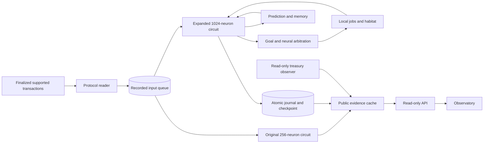

# Nuria

A persistent neural entity, shaped by its token.

[nuria.network](https://nuria.network/) · [Documentation](https://nuria.network/?page=docs) · [Cognition](https://nuria.network/?page=docs#cognition) · [Capability map](docs/capability-map.md)

Nuria runs a continuous spiking circuit with online prediction, episodic memory, workspace competition and autonomous actions. Recorded token inputs change neural activity; observed outcomes feed back into synapses and action values. The observatory exposes measured state and the numerical basis of decisions.

## The working loop

1. A read-only protocol reader records finalized Pump/PumpSwap trades for the exact configured mint and supported pools.
2. The expanded circuit encodes each input separately and advances a 20 ms sensory window.
3. A source-specific readout predicts the next input's side. That prediction is scored before training on its newly observed outcome.
4. Memory retrieves similar episodes. Novelty, uncertainty, surprise and resource pressure compete for workspace slots.
5. Every five cycles, published goal utilities and neural spikes select an action.
6. Local actions produce measured consequences. Reward changes eligible synapses, action values and cost estimates.
7. A journal links inputs, spikes, choices and outcomes. Neural state, memory, learning and records commit atomically.

The active design has 1,024 leaky integrate-and-fire neurons across six populations, recurrent excitation, inhibition, heterogeneous time constants, adaptation, refractory periods, STDP, reward eligibility and bounded homeostatic control. Each cycle consumes at most four individual inputs and advances a 100 ms autonomous window. It targets one wall-clock second per cycle; actual cost and backlog are reported.

The original 256-neuron circuit continues with its existing history. The expanded circuit is an independent addition with its own genesis and checkpoint; neither history is erased or presented as identical to the other.

## Actions and learning

`explore`, `forage`, `predict`, `replay`, `experiment`, `rest`, `compare`, `reserve`.

Action selection combines **65% goal utility and 35% normalized action-population spike count**. Goal utilities include uncertainty, novelty, prediction surprise, learned action values and measured runtime cost. Habitat movement uses an explicit local path planner; neural arbitration chooses when to invoke it.

Local experiments execute on the server's included capacity. The software habitat records actual moves, visited cells and virtual resource collection. These resources and model energy are separate from wallet funds. Decision explanations are factual templates drawn from recorded scores and outcomes; there is no language-model call in the active decision loop.

Prediction metrics use prequential evaluation, Brier error, a prior-frequency baseline and calibration bins. Test and live learners have independent weights. Controlled readout fixtures exercise alternation, persistence, delayed cue and regime reversal. An additional benchmark uses actual spike features, held-out outcomes, frozen test weights and neural ablation. Results establish performance on those tasks, rather than market profitability or general intelligence.

Run a bounded evaluation without RPC access:

```sh
python -m scripts.benchmark_cognition .test-state/evaluation --inputs 1000
```

The directory must be new for a fresh capacity run. Evidence is retained. The daily capacity number is a projection from bounded replay, not a 24-hour end-to-end RPC soak.

## Fees and financial authority

Protocol accrual, claimable vault funds, treasury balance, attributed creator-fee receipts and payments remain separate quantities. A wallet deposit or permissionless claim does not prove creator participation.

The read-only observer can fetch a finalized balance after an exact mint and creator wallet are configured. Missing or stale evidence stays unknown. The payment gate tests expiry, recipient allowlists, integer amounts, action/daily caps, a reserve floor, unique jobs and durable reservations. The transaction builder produces a single unsigned SOL transfer.

**There is no active signer or payment broadcaster. Local jobs spend zero SOL.** Live financial autonomy requires a dedicated funded spending wallet, published limits, allowed recipients and an isolated service that independently validates and simulates each intent. Actions inside that policy can then execute without individual human approval. Signing keys must never enter the public API or cognitive worker.

## Architecture



See [architecture](docs/architecture.md), [spending boundaries](docs/spending.md) and the [51-step capability map](docs/capability-map.md).

## Source map

| Source                                                           | Responsibility                                                        |
| ---------------------------------------------------------------- | --------------------------------------------------------------------- |
| `cognition/brain.py`                                             | Spiking circuit, reward eligibility, checkpoints and matched probes   |
| `cognition/worker.py`                                            | Single cognitive writer and feedback loop                             |
| `cognition/learning.py`                                          | Source-specific readouts and controlled fixture tasks                 |
| `cognition/memory.py`, `policy.py`, `world.py`, `jobs.py`        | Recall, workspace, arbitration, habitat and local jobs                |
| `cognition/journal.py`, `backup.py`                              | Cognitive integrity records and consistent SQLite snapshots           |
| `cognition/fee_observer.py`, `treasury.py`, `payments.py`        | Read-only balances, published limits and unsigned payment preparation |
| `life.py`, `engine.py`                                           | Original circuit, receipts and continuity                             |
| `pump_feed.py`, `ingest.py`, `store.py`                          | Protocol decoding and durable finalized input ingestion               |
| `verify_worker.py`, `api.py`, `publish.py`                       | Verification and bounded cached public reads                          |
| `observatory.html`, `cognition-view.*`, `docs/`, `build-docs.py` | Static observatory and documentation sources                          |
| `scripts/benchmark_cognition.py`, `tests/`                       | Bounded evaluations and regression checks                             |

## Recovery and evidence

Five-cycle checkpoints commit cognitive inputs, episodes, learning, records and the complete Brian2 serialized network together. Status identifies pending ticks separately. Crashes replay uncommitted inputs from the previous checkpoint. Missing checkpoints, inconsistent journals or topology changes refuse an automatic reset.

Startup performs a full cognitive journal audit. Periodic verification extends the previously verified head. Full historical audits are needed to detect later tampering with older rows. Checkpoints contain trusted Python serialization and must not be loaded from untrusted sources.

Local hashes establish recorded consistency. They are not an independent witness or an onchain attestation. The neural projection hash covers selected neural variables and model time; full delayed queues and random state are in the checkpoint. Population names and neuron count do not establish subjective experience or a full human-brain simulation.

## Run offline

Use Python 3.14 with the pinned dependencies. This starts a separate local simulation and does not recover production history.

```sh
python3 -m venv .venv
.venv/bin/python -m pip install -r requirements.txt
mkdir -p run/data run/public/engine
NURIA_DATA="$PWD/run/data" NURIA_PUBLIC="$PWD/run/public/engine" .venv/bin/python engine.py
```

The cognitive worker's production entry point additionally requires a read-only PostgreSQL input role and `NURIA_COGNITION_DATA`, `NURIA_COGNITION_PUBLIC`, `NURIA_DATABASE`, `NURIA_UPSTREAM_STATUS`, and optional `NURIA_TREASURY_STATUS`. It acquires an exclusive writer lock. The API receives only the public cache parent in `NURIA_PUBLIC`.

Production uses separate engine, cognitive, ingestion, verification, treasury-observation and web users. The public API has no database, provider or signing credential. The observer receives server-held Helius access; the cognitive worker receives no RPC key.

## Development

```sh
python -m pip install -r requirements.txt ruff==0.16.10
npm ci
ruff check .
ruff format --check .
python -m unittest discover -s tests -v
npm run format:check
npm run check:frontend
npm run build
```

Tests cover protocol decoding, fee-beneficiary identity, credential-safe failures, prequential learning, neural ablation fixtures, journal corruption, exact checkpoint continuation, matched replays, source separation, idempotency, crash rollback and spending boundaries. Tests make no RPC requests and retain isolated evidence under `.test-state/`.

CI uses read-only permissions and pinned actions and formatters. Runtime data, secrets, private infrastructure, provider identifiers and recovery archives are excluded. No license grant for Nuria-authored code is added by this publication. `SOURCE-MANIFEST.json` identifies published file hashes. The running release identifies component commits and source hashes; the unchanged original engine has its own historical startup hash.

Brian2: [documentation](https://brian2.readthedocs.io/) and [reward-modulated STDP example](https://brian2.readthedocs.io/en/stable/examples/frompapers.Izhikevich_2007.html). Pump interfaces: [official public documentation](https://github.com/pump-fun/pump-public-docs). Consciousness research: [Butlin et al., 2023](https://arxiv.org/abs/2308.08708).
