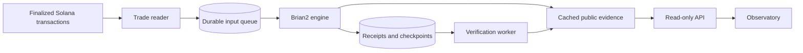

# Nuria

A persistent spiking neural network shaped by token activity.

Website: [nuria.network](https://nuria.network/) · Documentation: [model and evidence](https://nuria.network/?page=docs)

This repository contains the observatory, Brian2 model, finalized Solana trade reader, durable storage, evidence API, verification worker and backup implementation. It is a reviewed source snapshot, rather than the deployment's original Git history.

## Current implementation

- 256 leaky integrate-and-fire neurons with adaptation, excitatory plastic synapses, inhibitory connections and independent Poisson background input.
- Six populations, recurrent connectivity, spike-timing-dependent plasticity and a bounded controller for background firing rates.
- The simulator advances 200 ms per window and targets one wall-clock second per window. Model time and wall-clock time are reported separately.
- A queue feeds finalized Pump/PumpSwap trade events into buy and sell sensory populations. The reader checks program event schemas, mint and supported pools; unresolved transactions remain pending.
- Neural output scores select `compute`, `experiments`, `reserve` or `observe`. **These are proposals in this version. There is no spender or signing key.**
- Persistent checkpoints restore neural variables and random state. Hash receipts link input evidence, raw spikes, membrane hashes, weight hashes and policy scores.
- The public API reads cached evidence, with no database, RPC or signing credentials in the web process.

When no mint is configured, the model uses clearly tagged simulated trade signals. Simulated fee accrual uses an illustrative 0.3% rate. Decoded creator-fee event accrual is distinct from money received by a treasury.

## What the evidence proves

The receipt chain checks the consistency of recorded inputs, spikes and local receipts. It is not independently witnessed or anchored on Solana. Neural population names describe the model's organization; they do not demonstrate human cognition, biological neurons or consciousness. STDP changes weights, but useful task learning has not yet been demonstrated with a benchmark.

Trades are recorded individually and processed in batches of up to 100 per neural window. Their sensory drive is summed by side and capped at 3. A saturated batch can therefore have the same neural drive as another batch. This version does not establish a unique neural effect for every trade or guarantee coverage of every possible Solana trading venue.

No claim is made that 100,000 trades per day has been load-tested. Actual throughput depends on RPC coverage, provider limits, scan backlog, database retention and simulation cost.

## Architecture



See [architecture and invariants](docs/architecture.md) for the processing boundaries, recovery rules and model parameters.

## Source map

| File                                         | Responsibility                                               |
| -------------------------------------------- | ------------------------------------------------------------ |
| `life.py`                                    | Neural dynamics, input queue, checkpoints and receipt chain  |
| `engine.py`                                  | Single neural writer and cached model exports                |
| `pump_feed.py`, `ingest.py`                  | Bounded finalized trade ingestion                            |
| `store.py`, `schema.sql`                     | PostgreSQL store and offline SQLite support                  |
| `verify_worker.py`                           | Incremental verification and bounded evidence exports        |
| `api.py`, `publish.py`                       | Read-only HTTP API and atomic JSON publishing                |
| `observatory.html`, `docs/`, `build-docs.py` | Observatory and documentation source                         |
| `index.html`, `docs-script-check.js`         | Generated frontend bundle and script for syntax checking     |
| `backup.py`, `backup_snapshot.py`            | Encrypted backup and consistent database/checkpoint snapshot |
| `migrate_store.py`                           | Offline import into an empty PostgreSQL destination          |

## Reproduce the neural model offline

Use Linux or macOS with Python 3.14 and the pinned dependencies. This creates a **new local simulation history** and does not recover or overwrite the live network.

```sh
python3 -m venv .venv
.venv/bin/python -m pip install -r requirements.txt
mkdir -p run/data run/public/engine
NURIA_DATA="$PWD/run/data" NURIA_PUBLIC="$PWD/run/public/engine" .venv/bin/python engine.py
```

Stop with Ctrl+C; the engine saves its pending receipts and checkpoint. Use the same directory to resume. Keep checkpoints trusted: they contain Python/Brian2 serialized state and must not be loaded from untrusted sources.

A separate terminal can inspect the locally written JSON. The engine defaults to SQLite when `NURIA_DATABASE` is unset. This offline mode does not support the separately running PostgreSQL ingestor/verifier services.

```sh
cat run/public/engine/status.json
```

For the read-only API, with the model still running:

```sh
NURIA_PUBLIC="$PWD/run/public" .venv/bin/python api.py
```

The API listens on `127.0.0.1:3040`. Model endpoints are available immediately; verification/download endpoints need the separate PostgreSQL verification worker. The frontend expects same-origin `/api/` routes through a reverse proxy.

## Production service boundaries

The live architecture uses separate engine, ingestor, verifier and web processes with PostgreSQL roles. Provision the roles before applying `schema.sql`. Supply `NURIA_DATABASE` only to workers that need it; the web API has no database connection.

| Process  | Environment / private configuration                                                                                                   |
| -------- | ------------------------------------------------------------------------------------------------------------------------------------- |
| Engine   | `NURIA_DATA`, `NURIA_PUBLIC` pointing to the engine cache, `NURIA_DATABASE`, optional `NURIA_FEED_STATUS`                             |
| Ingestor | `NURIA_DATABASE`, `NURIA_FEED_DIR`, `HELIUS_API_KEY`, optional `HELIUS_RPC_URL`; private `pump-source.json` containing the exact mint |
| Verifier | `NURIA_DATABASE`, `NURIA_PUBLIC` pointing to the verification cache                                                                   |
| API      | `NURIA_PUBLIC` pointing to the common cache parent                                                                                    |
| Backup   | `NURIA_BACKUP_BUCKET` plus private provider credentials and public encryption recipient configured outside the repository             |

The migration and backup scripts assume the documented Nuria service names and Linux paths. They are operational tools, not a turnkey installer. The full dependency snapshot includes backup libraries in `requirements.lock.txt`.

Secrets, wallet keys, service credentials, DNS/account identifiers, historical checkpoints, database dumps and private deployment runbooks are intentionally absent. No license grant for Nuria-authored code is added by this publication.

## Public decision record

The existing receipts expose the actual input IDs, sensory drive, policy spike scores, selected proposal, neural state hashes and `funds_spent` (currently zero). The record exposes the numerical basis of each proposal.

A future autonomous executor would need independently verified treasury receipts, published spending constraints, isolated signing, job cost accounting, outcome measurements and feedback into the model. None of those financial execution features is implemented in this snapshot.

## Development

```sh
python3 -m venv .venv
.venv/bin/python -m pip install -r requirements.txt ruff==0.16.10
npm ci
.venv/bin/ruff check .
.venv/bin/ruff format --check .
.venv/bin/python -m unittest discover -s tests -v
npm run format:check
npm run check:frontend
npm run build
```

The test suite covers protocol decoding, fee-beneficiary identity, rejection of malformed evidence, input idempotency, credential-safe errors and checkpoint continuity. It makes no RPC requests and uses isolated directories under `.test-state/`. Test evidence is retained for inspection and excluded from Git.

CI has read-only repository permissions and checks the rebuilt frontend against the committed bundle. Action revisions and formatter versions are pinned.

## Source provenance

`SOURCE-MANIFEST.json` records the source and published hashes for every exported application file. The public release includes consistent source formatting, a configurable backup bucket, explicit backup integrity guards, an input-evidence length check, and a documentation build that supports formatted HTML. Neural dynamics and trade-decoding semantics are preserved. These source-review changes have not been deployed to the live services. A receipt's source hash identifies the engine's startup snapshot, and must not be assumed to equal a later repository commit or frontend update.

The Pump and PumpSwap JSON interfaces originate from the [official Pump public documentation](https://github.com/pump-fun/pump-public-docs). Brian2 reference: [documentation](https://brian2.readthedocs.io/).
