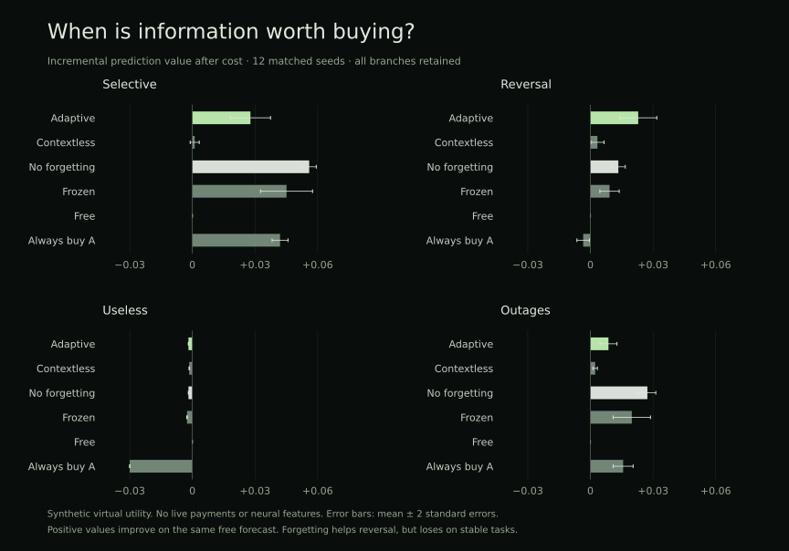

# Choosing information worth buying

Nuria needs to learn when an outside resource is worth its cost, when its own information is enough, and when a source has stopped helping. A separate acquisition experiment now tests those choices. It is an implemented statistical controller with persistent records, not a neural circuit, a real purchase or an established benefit to the main organism. The production purchase selector remains the published heuristic in [spending.md](spending.md).

## The decision and evidence

Each opportunity provides an observable context, a free probability forecast and two provider quotes. The controller commits its selection and quoted virtual price before seeing a provider response. It commits the delivered forecast, or failed delivery, before the later label arrives. Only the chosen provider receives learning credit. Unchosen forecasts and the generating rules remain outside the controller.

The measured value is:

```text
gross gain = free forecast Brier error − selected forecast Brier error
net gain   = gross gain − virtual purchase cost
```

Failed delivery falls back to the stored free forecast and still incurs the purchase cost. The free choice has exactly zero incremental value and cost. This comparison uses the same forecast opportunity and label in every branch. It does not assess trading profit.

Decisions, deliveries and delayed outcomes commit atomically to SQLite with a hash-linked journal. Reopening reconstructs estimates from selected-source outcomes and rejects inconsistent trial rows or estimates. Repeated identical outcomes are idempotent; changing a settled outcome is rejected. These are local consistency checks, not independent evidence that an external purchase happened.

The controller currently accepts only `synthetic:` scopes. Synthetic observations cannot enter production financial learning through this module. It has no signer, RPC, merchant integration or live spending authority.

## Selection rule

For each observed context and provider, Nuria estimates gross prediction improvement from that provider's selected outcomes. It subtracts the current quote and normally selects a provider only when this estimated net improvement exceeds the zero-cost free choice. A per-job virtual ceiling filters quotes before selection.

The estimate starts at zero. Its update rate is the larger of `0.08` and `1 / new_observation_count`, so old observations eventually lose influence. Bounded deterministic exploration uses `max(0.02, 0.2 / sqrt(1 + context_observations / 10))`, selecting uniformly among affordable providers and the free choice. This mechanism keeps testing sources after they become unattractive, but exploration has a real opportunity cost in the virtual experiment.

Neither this utility scale nor its virtual prices are USDC. A production mapping would need actual delivery contracts, useful outcomes, controlled exploration terms and all existing custody and budget gates. Synthetic results do not authorize a live payment.

## Frozen protocol and matched controls

The protocol was written to a local file before execution. This is not independent preregistration. Twelve seeds, 301–312, each generate 1,600 opportunities. The first 300 are warmup. Feedback arrives two to eight opportunities later. Six branches share the exact same latent opportunity stream, verified by a per-world hash:

- Contextual adaptive selection.
- Context-independent adaptive selection.
- Contextual selection without forgetting, using the cumulative sample mean.
- Contextual selection with learning frozen after warmup.
- The free forecast alone.
- Always buying provider A.

The controller sees neither the task name nor future labels. A selective task makes purchases useful in uncertain contexts but redundant in confident ones. A reversal task changes which provider helps halfway through. A useless control returns the already available free forecast. An outage task includes paid delivery failures from a useful provider.

Across four tasks, 288 trials score 374,400 post-warmup choices. A second local run reproduced every trial, journal head and summary exactly. Both runs use the same implementation and seeds; independent replication remains a gate.

## Results, including failures

Mean incremental net virtual utility; higher is better. Zero means using the free forecast alone.

| Task      |    Adaptive | Contextless | No forgetting |   Frozen |  Free | Always buy A |
| --------- | ----------: | ----------: | ------------: | -------: | ----: | -----------: |
| Selective |     0.02782 |     0.00113 |   **0.05596** |  0.04511 |     0 |      0.04200 |
| Reversal  | **0.02289** |     0.00337 |       0.01338 |  0.00917 |     0 |     −0.00345 |
| Useless   |    −0.00187 |    −0.00151 |      −0.00187 | −0.00254 | **0** |     −0.03000 |
| Outages   |     0.00865 |     0.00229 |   **0.02729** |  0.01983 |     0 |      0.01568 |



Contextual adaptive selection beats its context-independent branch on selective and reversal tasks in all twelve seeds; their paired mean-minus-two-standard-error bounds are positive. Forgetting improves the reversal comparison against cumulative learning in nine seeds, with a small positive descriptive lower bound of approximately 0.00020. It performs substantially worse than cumulative learning on the stable selective and outage tasks.

On the useless control, the controller learns to prefer free information but continues exploring. It still pays on 5.5% of last-quarter opportunities and loses approximately 0.00187 utility per scored choice. Free-only is better. It also fails to beat always buying A on the selective and outage tasks. These failures preclude claiming a generally superior acquisition policy.

The reported paired bounds are descriptive, not multiplicity-adjusted confidence intervals or generalization guarantees. Full precision, seed-level trials, costs, failures, branch choices and journal heads remain in [acquisition-evaluation.json](acquisition-evaluation.json).

## What this adds, and the next gate

The project can now reproduce a complete choice → information → delayed outcome → changed future choice loop with explicit costs and refusal, separately from its financial implementation. It gives a concrete way to test whether paid resources improve decisions. It does not establish live merchant usefulness, integrated neural advantage or consciousness.

Before promotion: reduce waste on redundant sources without losing reversal recovery, validate on new unseen tasks and seeds, compare stronger acquisition policies, then connect a real measurable provider in shadow mode. Only verified payment, delivery and later usefulness can establish the fee-funded loop.

## Reproduction

```sh
python -m scripts.evaluate_acquisition .test-state/new-acquisition-run
```

Use a new directory. Existing evidence is retained. The protocol hash is `d4ddc33ad7a5500c6227dbba074d4031ca191dcf941cab638a703ccc73d749b6`. Implementation hashes are recorded with the results. Neither evaluation nor controller makes network requests or signs transactions.
