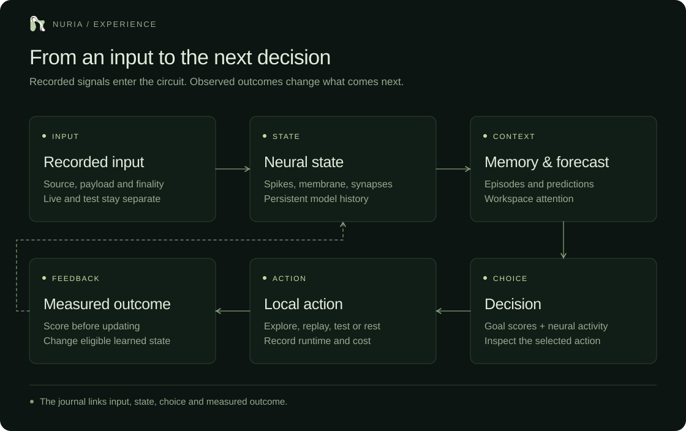

# Architecture

Two independent circuits read the same durable finalized input queue. The original 256-neuron circuit retains its complete existing history. A read-only PostgreSQL role supplies the expanded cognitive circuit, which owns a separate SQLite journal and trusted Brian2 checkpoint. Its own genesis is published; the two histories are never treated as the same neural state.

## Cognitive cycle

An isolated decision laboratory now runs alongside these two histories. Its own 256-neuron sensory circuit feeds learned cue representations, costed sensing and delayed-feedback action learners. Seven matched branches include a direct symbolic-memory comparator. It owns a third private SQLite journal and complete Brian2 checkpoint, has no RPC/database/signing credentials, and reads only the main circuit's public cache to perturb virtual information prices. The API reads its public `discovery/status.json` cache with a 15-second freshness gate. See [the complete experiment protocol](discovery.md). The main cognitive action rule below is unchanged; lab capability is not attributed to that rule.

Each cycle reads at most four inputs in event order. Each valid input gets an independent 20 ms sensory window, source-specific forecast, episode and input-effect record. Side, amount, fee and event-ID texture enter sensory drive. Recalled features stimulate the memory population. A 100 ms autonomous window follows.

Every five cycles, 65% goal utility and 35% normalized action-region spikes select one of eight actions. Habitat moves use an explicit local planner. Replay and matched probes operate on recorded episodes. Retrospective component diagnostics execute on recorded inputs with measured CPU/wall time. Observed prediction improvement and action consequences modulate synaptic eligibility and learned action values.

Source-specific neural readouts and forecast councils prevent test training from changing live predictor parameters. The council combines seven specialists using learned squared-error attention and conditional transition memory. Its metrics and start time are separate from retained old neural readout metrics. Shared neural dynamics still reflect all recorded inputs; source separation does not claim separate physical circuits for test and live. Recall now restricts candidates to the current input source.

The experiment action performs a retrospective chronological comparison on recorded same-source inputs. It cannot reconstruct past neural forecasts from payloads, so those diagnostics exclude the neural specialist in every branch. They are observational component checks rather than new hypotheses or controlled interventions. See [evaluation](evaluation.md).

## Circuit parameters

| Population         | Range    | Membrane time constant |
| ------------------ | -------- | ---------------------- |
| Sensory            | 0–127    | 12 ms                  |
| Association        | 128–511  | 20 ms                  |
| Recurrent memory   | 512–639  | 45 ms                  |
| Workspace          | 640–767  | 20 ms                  |
| Action readout     | 768–895  | 20 ms                  |
| Inhibitory control | 896–1023 | 20 ms                  |

Refractory period is 4 ms. Excitatory/inhibitory decay is 8/12 ms. Adaptation decay is 350 ms. Excitatory connections sample probability 0.025 from sources below 896, with 1–12 ms delays, STDP traces and reward eligibility. Inhibitory sources use probability 0.05 and 2 ms delays. Self-connections are excluded. Homeostatic bias and background rates are bounded.

## Commit and recovery

SQLite uses WAL and full synchronous commits. Inputs, effects, memory, learning metadata, journal head and serialized network commit every five cycles. A graceful shutdown commits the pending state. A crash rolls back the uncommitted transaction; the prior network and cursor restore together. Status exposes latest and committed ticks separately. An exclusive file lock prevents competing workers.

Checkpoint hash, model version and topology are checked before trusted deserialization. Missing or mismatched checkpoints refuse a reset. The neural projection hash covers membrane, conductance, adaptation, bias, drives, time constants, weights, traces, eligibility, model time and offset; delayed queues and RNG are covered by the full checkpoint, rather than that projection.

Startup audits the complete cognitive chain. Periodic checks extend the previous verified head. They do not silently claim that every historical row was rescanned. Input source payload and raw spike hashes are bound to records, and record kind is inside the hashed payload.

## Service boundaries

| Service           | Authority                                                                                   |
| ----------------- | ------------------------------------------------------------------------------------------- |
| Original engine   | Original neural history and receipt writes                                                  |
| Ingestor          | Protocol RPC, transaction queue and source cursors                                          |
| Cognitive worker  | SELECT on input queue; writes only its state and public cache                               |
| Verifier          | Read original evidence and publish bounded verification exports                             |
| Treasury observer | Read-only finalized wallet RPC; no database or signer                                       |
| Commerce worker   | Fixed paid-job catalog, isolated hot-wallet adapter, durable limits and exact USDC evidence |
| API               | Read bounded cached files; no RPC, database or signing credential                           |
| Backup            | Consistent snapshots and private encrypted upload                                           |

The public interface cannot enqueue inputs, run jobs or prepare payments. Missing or stale evidence returns unavailable. The original and cognitive status require a running phase and fresh cache for aggregate health. Immutable topology and benchmark artifacts are not treated as rolling live status.

The commerce worker reads fresh public cognitive decisions and can execute only configured exact Solana USDC jobs. Its private ledger records authorization before disclosure and distinguishes payment, delivery and evaluation. Verified paid outcomes enter cognitive action values with a checkpointed sequence cursor; delayed payment results do not modify unrelated synaptic eligibility traces. The public API reads `commerce/status.json` with a 60-second freshness gate. Financial execution remains disabled. The selected architecture uses one managed creator-beneficiary/operating wallet, restricted runtime custody, pinned native collection and constrained Jupiter conversion. A separate managed creator wallet can forward only to the fixed operating address when explicitly configured. No reserve vault or multisig is required; older reserve adapters remain unconfigured. Exact accounts, beneficiary authority, program pins and live end-to-end verification remain prerequisites. A separate wallet observer publishes finalized movements and visible coverage gaps. The API serves complete bounded financial pages from public cache. See [spending](spending.md) for the concrete activation requirements and custody limits.

## Capacity and retention

The circuit has a nominal four-input-per-cycle limit and one-second pacing. Measured cycle cost determines actual capacity. The original reader uses eight fetch workers and a shared 15-request-per-second limiter; RPC coverage is an independent bound. Public endpoints use cached bounded files and never replay the neural model for a visitor.

A bounded server benchmark checks actual input processing, checkpoint commits, source cursor and full journal integrity. A daily projection does not establish a 24-hour provider-to-browser soak. Record size and disk growth must be monitored. Capacity thresholds fail with evidence retained; automatic deletion or unlimited-storage claims are not part of the design.

## Backups

The original circuit retains its PostgreSQL snapshot and matching checkpoint. The cognitive service uses SQLite's online backup to copy a committed network and journal. Both enter the encrypted private archive with separate heads. Recovery must verify and restore each circuit independently. The backup recipient is public; its private recovery key stays off the server.

The commerce ledger also uses a consistent SQLite snapshot and local hash-chain verification before entering the existing encrypted archive. Wallet signing files are excluded and need a separately controlled recovery procedure before provisioning.

## Commission requests

The isolated commerce writer also owns the [commissioning controller](commissioning.md). It stores task commitments and private evaluation vectors in its existing SQLite database, records public hash events and exports a bounded read-only projection. A fresh eligible decision may create a local proposal, without wallet or network authority. The current worker cannot dispatch marketplace orders or sign Base payments. Commission memory is task-specific and is not credited to the neural worker. Its guarded lifecycle and external activation requirements are separate from the Solana x402 executor.
