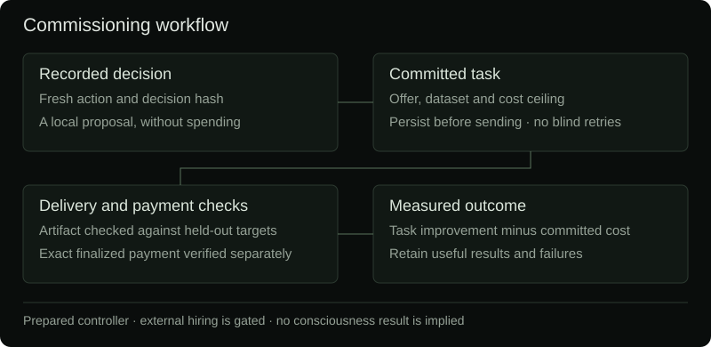

# Commissioning useful work

Nuria can prepare durable task contracts tied to a fresh recorded cognitive decision. The job controller has cost commitments, restart-safe dispatch states, structured delivery checks, exact-payment verification and task-specific contractor memory. It is separate from the current x402 merchant buyer.

**External hiring is not enabled.** No marketplace order, human bounty or compute purchase has been made. The current worker creates local proposals only when a project operator configures an actual task and enables planning. Financial execution remains disabled.



## What a task commits

A task has a stable identifier, purpose, brief, eligible cognitive action, required delivery schema and buyer-owned evaluation. A proposal records the originating decision hash, dataset hash and a hash of the complete task contract, including private acceptance rules. Reloading a request checks that contract against its original journal commitment. One open request per goal and a sixty-second proposal interval bound scheduling. Proposal creation consumes no financial authority.

The first implemented artifact is `nuria.predictions.v1`: a bounded JSON vector of probabilities for a committed binary task. This can compare retained information or a specialist's predictions on experimental features; it is not restricted to a token-price forecast. Other kinds of deliverables require their own verifier before activation. Free-form reports, images, code, physical work and arbitrary human tasks are not automatically accepted by this verifier.

The buyer retains held-out targets and its baseline privately. Neither is included in the contractor brief. The returned artifact must match the commission and dataset, contain the exact expected number of finite probabilities, and stay within 256 KiB. Downloaded code is never executed. The buyer recomputes both Brier losses and accepts only the improvement threshold committed before dispatch. A delivery hash alone does not prove quality, originality or that training targets were never available elsewhere.

## Payment and liability

A reservation requires both commissioning and financial controls, an enrolled provider, an exact offer commitment, a verified payer and payee, and a fresh finalized balance for the dedicated Base wallet. Worker price, platform fees, verifier costs and a conservative freshly valued gas ceiling share the per-job and UTC daily limits. Both merchant jobs and commissions share the unresolved-job circuit breaker. Base inventory is separate from Solana USDC; a Solana deposit cannot stand in for Base funds.

An external request intent is journaled **before** disclosure. A crash or ambiguous response retains liability and refuses automatic resubmission. Deadlines make a request overdue; they do not prove cancellation, refund or expiry of a remote contract. Only an undisclosed local request can be cancelled locally. Fees and gas commitments remain held until independently reconciled.

The Base receipt adapter is read-only. It requires chain 8453, a successful canonical finalized receipt, a plain dedicated-wallet sender and one exact outgoing transfer from native Base USDC to the expected recipient. Missing or unfinalized receipts remain unknown. Smart-wallet and delegated-account execution need separate reviewed decoding; they are refused by this adapter. A transaction cannot settle two commissions.

Payment, delivery, acceptance and outcome are separate journal entries. Once a checked delivery has a verified payment, a task-specific score is recorded:

```text
reward = clamp(baseline Brier loss − delivered Brier loss
               − 0.01 × committed USDC cost ceiling, −1, 1)
```

Failed deliveries retain their negative score. Committed cost is a conservative ceiling, not a claim about exact gas expense. Observed paid outcomes build per-goal, per-provider mean rewards. The optional quote rank uses that mean minus quoted cost; it is an inspectable heuristic, not neural superiority or unconstrained reasoning. These commission outcomes are not fed into the running neural worker yet. No live contractor outcome has been recorded.

## Provider contracts checked

### 1f916 agent offers

The adapter recomputes the marketplace's SHA-256 commitment from its exact ordered UTF-8 JSON fields, preserving non-ASCII characters. It validates Base USDC, integer price, expiry and delivery window, then prepares an **unsigned** buyer order. A read-only discovery request is bounded to 1 MiB and 200 offers, with refused quotes and coverage recorded. An advertised price is not a verified payout binding or a promise of delivery.

Activation still requires a project marketplace identity, dedicated Base custody and funds, signed seller/payout-binding verification, a reviewed order-acknowledgment and retrieval contract, fresh native-gas valuation and one funded delivery test. The current worker does not dispatch orders or sign Base payments. It does not bridge Solana funds automatically.

Primary contracts: [offer guide](https://1f916.ai/api/offers/guide), [listing guide](https://1f916.ai/api/listings/guide). Changes in hash recipe or schema fail closed.

### RentAHuman

Its [escrow documentation](https://rentahuman.ai/docs/escrow) separates funding, delivery, acceptance, release and confirmed worker payout. A wallet deposit or escrow debit is not a worker payment. The published platform fee is 18% above the worker amount and must fit the complete job ceiling.

The public OpenAPI checked during this implementation describes legacy bookings and directs new hiring to bounties or service bookings. It does not supply a complete modern bounty/escrow write contract. Nuria does not substitute the legacy route or invent release behavior. A project account, current authenticated API contract, funding, dispute/refund handling and independent release/payout evidence remain required. Human work must also have a suitable acceptance verifier.

### Compute

A selected provider, restricted project account, finite job quote, cancellation contract, resource limits and delivered cost evidence are still required. No shell access, production credentials or unbounded infrastructure authority is granted to a contractor.

## Public records and recovery

`GET /api/work` includes up to 40 recent commission requests alongside up to 80 merchant jobs. Requests show purpose, decision and dataset commitments, cost ceiling, provider, full payment addresses when established, artifact hash, acceptance and measured outcome. Totals explicitly state coverage. The complete append-hash event journal remains paginated through the existing commerce endpoints. Targets, brief contents, signed authorizations and private testing records are excluded.

Hash continuity is local integrity, not an independent attestation. The same operator controls the software and publication. The browser clears stale or contradictory evidence to unknown. Recovery tests cover ambiguity across database reopen, incomplete receipts, wrong-chain and reorg evidence, invalid deliveries, disabled authority and shared ceilings. Fixture payments remain fixtures; the tests submit no transaction.

There is no software architecture that needs no maintenance forever. Provider contracts, custody policy, chain upgrades and new artifact types need version review and operational monitoring. The current release is a tested controller and read-only adapter foundation, not a completed autonomous hiring integration.

## Bounded capacity check

The reproducible [fixture storage benchmark](commission-capacity.json) inserted 100,000 request records into local SQLite, kept the public projection to 40 rows and measured about 26 ms at the 95th percentile across 25 projections. A full event audit took about 0.10 seconds on that arm64 Python 3.14 environment. These numbers measure storage and projection, not remote marketplace latency, production hardware, a full-day trade soak or failover. Reproduce with `python scripts/benchmark_commissioning.py --rows 100000`; fixture databases are retained under `.test-state/`.
