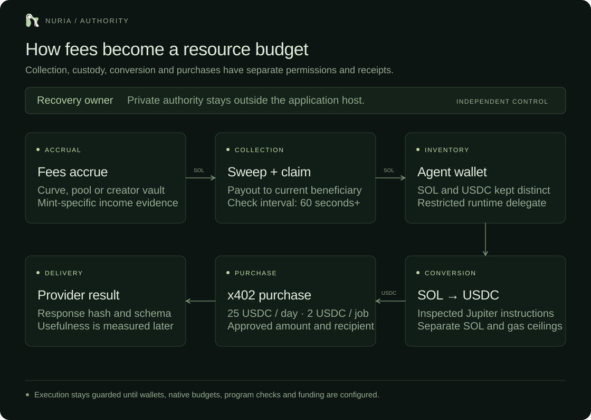

# Fee funding and autonomous purchases



The commerce worker translates fresh recorded cognitive decisions into a fixed catalog of paid jobs. It runs independently of the neural worker and the public API. Execution is disabled in the installed policy; no production purchase has been made.

## The money path

```text
Pump/PumpSwap trade
  → curve/pool fee buckets and creator vault
  → sweep and claim to the verified current beneficiary
  → dedicated agent wallet (or explicit managed forwarding)
  → Solana USDC inventory
  → approved x402 provider
  → finalized payment + validated delivery
  → future measured outcome + purchasing-action credit
```

These stages are distinct integrations. The managed exact-USDC buyer, legacy collection adapter, optional creator-to-agent forwarding and constrained Jupiter converter have offline tests. The preferred route uses one managed agent wallet as the creator beneficiary and spending address. Its recovery owner is separate from the restricted runtime delegate. Production remains disabled. New Pump sweep-and-claim interfaces and the exact launch identity still require review; unsupported modes remain blocked. Collection checks are at least sixty seconds apart, with durable cadence and unresolved-submission protection.

A creator vault can aggregate income from multiple coins. Its whole balance cannot be attributed to Nuria without mint-specific trade and payout evidence. A permissionless payout says who received funds, not who endorsed the project.

## Initial paid job

The first delivery contract is `nuria.forecast.v1`:

```json
{
  "schema": "nuria.forecast.v1",
  "mint": "<configured Solana mint>",
  "source": "solana_finalized",
  "p_buy": 0.6,
  "expires_at": 1780000060
}
```

`p_buy` must be a finite probability. Expiry must be in the future and no more than ten minutes after receipt. The merchant must return data for the configured mint. These example values are a schema illustration, not a live prediction or provider.

A matching `predict`, `experiment` or `compare` action may purchase a forecast when:

```text
0.5 × uncertainty + 0.25 × surprise + 0.25 × learned provider reward
  − 0.1 × provider price ceiling / per-job cap > 0.1
```

Provider selection is a published hybrid heuristic, not unconstrained reasoning. Only the actual `solana_finalized` learning source qualifies. Test inputs cannot trigger purchases. A fresh decision must pass its local record-hash check.

The delivered forecast is evaluated against the first observable finalized trade whose block time is later than delivery. The local forecast was recorded before the purchase. Missing transaction timestamps, a gap in the recent input cache, or no future trade leaves usefulness unresolved. This is an operational comparison rather than a fair causal benchmark: the provider has later information, and the cost coefficient is a configured design choice.

```text
reward = clamp(local Brier error − paid Brier error − 0.01 × USDC price, −1, 1)
```

Verified rewards update the purchasing action's value once. The feedback cursor, neural state and cognitive journal share the checkpoint transaction. Delayed results do not modify unrelated spike eligibility traces. Provider rewards also affect future paid-job selection. Invalid delivery receives no delivery or learning credit; an expired forecast is penalized when a later verified outcome becomes available.

## Exact x402 execution

1. Fetch an unpaid invoice from the exact approved HTTPS endpoint. Private DNS addresses, redirects and credential-bearing endpoints are rejected; responses are bounded to 256 KiB.
2. Accept one x402 v2 `exact` option for Solana mainnet and native USDC only. Recipient, facilitator fee payer and price must match policy. Seller blockhashes and unsupported extensions are rejected.
3. Reserve integer micro-USDC using a SQLite immediate transaction. Apply action and UTC daily caps, reserve floor, outstanding authorizations and a global cooldown.
4. Build through pinned `x402[svm]` 2.25.0. Before the key signs, inspect the v0 message: two required signers, no address lookup tables, exact known accounts, two fixed compute instructions, one exact USDC `TransferChecked`, and a bounded memo. No approval, delegate, authority change, account close, SOL transfer or arbitrary instruction is accepted.
5. Strip signatures and simulate the exact message through project RPC. The configured facilitator pays gas; its signature remains absent until settlement.
6. Record a finalized wallet-history checkpoint before signing. Persist the authorization before disclosing it to the merchant. Send it in `PAYMENT-SIGNATURE` once.
7. Retain the merchant's `PAYMENT-RESPONSE`; verify the reported transaction through finalized RPC. Nuria's client signature must appear, and both associated-token balance deltas must equal the authorized USDC amount.
8. Record payment settlement, then separately validate delivery and later score its outcome.

A timeout after authorization disclosure is ambiguous. Reserved, authorized and uncertain funds stay reserved across restart and UTC day rollover. The worker reconciles a retained receipt, never automatically pays again. Without a merchant transaction identifier, recovery scans finalized wallet transactions back to the pre-signing checkpoint. A matching inclusion is verified separately for exact USDC deltas. Expiration only closes a job when its blockhash is invalid at finalized commitment and the complete bounded scan reaches that checkpoint without a match. Missing pages, transaction data or an old unanchored authorization preserve uncertainty. This relies on the configured RPC history, not an independent archive attestation. Failed requests conservatively consume the daily allowance. Successful payment with invalid data remains a paid job without delivery credit.

## Keys and authority

`nuria-commerce` owns its private payment ledger and reads a root-managed policy. There is no inbound port or general signing endpoint. The public API only reads sanitized cache files. The neural worker has no RPC or signing credential. The SDK runs in a separate environment to preserve the existing neural dependency versions.

The production adapter uses Privy’s official Node SDK 0.35.0 to sign parsed transactions. The worker holds a delegated authorization credential rather than a Solana wallet private key. Each request checks the wallet’s independent owner, the delegate’s exact policy attachment and a pinned, independently owned policy hash. Returned signatures must preserve the exact message and every other signature. No raw-message signing endpoint, key export or unrestricted signing API is called. The local key adapter is retained for explicitly configured tests only.

UTC daily reservations, a monthly ceiling of 40,000 signing requests, a minimum sixty-second job interval and a three-unresolved-job breaker are enforced before new purchases. Custody errors consume their signing-request reservation. These controls do not make the host immutable: an administrator retains local control. Independent policy ownership and exact custody instruction/recipient restrictions constrain the operating credential. There is no reserve vault; operating inventory remains exposed within that actual policy. Privy’s stateful cumulative policy controls are currently Ethereum-specific; no hard Solana daily custody cap is claimed.

Do not place wallet keys in chat, the browser, source control, research history or prompts. Recovery ownership and signer provisioning must be settled before funding. Do not reuse a personal or unrelated project's wallet.

## Required launch configuration

| Input                                                 | Why it is needed                                                                        |
| ----------------------------------------------------- | --------------------------------------------------------------------------------------- |
| Exact token mint                                      | Connect trade ingestion and all fee/provider evidence to one token                      |
| Current fee beneficiary and launch mode               | Verify the actual payout route; unsupported modes require their own adapter             |
| Dedicated spending public address and isolated signer | Give only the financial service bounded operating authority                             |
| Per-job/daily USDC caps, reserve and cooldown         | Define the scope authorized once, without per-purchase human approval                   |
| USDC inventory                                        | The x402 rail cannot pay from a SOL balance                                             |
| Real compatible provider                              | Fixed endpoint, recipient, facilitator fee payer, price ceiling and measurable delivery |
| Fee collection/funding rail                           | Needed for continuous fee-funded operation rather than an initial prefunded test        |

An x402 buyer does not inherently need a separate x402 API key. The seller may require its own API authentication or onboarding. The initial adapter intentionally accepts credential-free endpoints; authenticated merchants need a separate reviewed credential mechanism.

[Jupiter Swap API](https://developers.jup.ag/docs/swap) currently requires an API key. Automatic SOL-to-USDC conversion needs project-specific access plus an independently validated swap adapter, maximum SOL input, slippage/minimum USDC output, fee limits and reserve protection. A generic externally supplied transaction must not be forwarded to the signer. Token buybacks are a separate authorization and rail.

The direct-wallet route requires the actual creator beneficiary to equal the agent operating address. A manually controlled external creator wallet requires manual forwarding; the agent cannot acquire its fees by configuration alone. An optional separate managed creator wallet needs its own restricted delegate and exact forwarding destination. No multisig is required.

## Public evidence

`/api/commerce` publishes current policy, readiness gaps, verified fee-path observations, finalized USDC inventory, daily commitments, monthly signing requests, job counts, settlement records, delivery hashes, measured rewards and a local event-hash chain. It never publishes the payment authorization header or key. Local hashes detect altered records; they are not independent attestations.

The Resources tab shows payment, delivery and evaluation separately. The original `/api/treasury` remains a read-only creator-wallet balance view. SOL balance, USDC inventory and attributed income remain distinct.

## Verification

Offline tests cover hostile invoices, wrong chains/assets/recipients, private DNS, caps, duplicate decisions, concurrent database handles, crash recovery, uncertain payments, exact settlement deltas, invalid deliveries, Pump mode/program gates, real SDK partial signatures and once-only cognitive feedback. They use ephemeral unfunded fixture keys and synthetic RPC responses. A restricted funded merchant attempt returned a facilitator validation error; successful settlement and delivery remain unproven. Offline tests do not replace the exact launched fee-path verification.

References: [x402 buyers](https://docs.x402.org/getting-started/quickstart-for-buyers), [Solana signing](https://solana.com/docs/core/transactions/signing-in-production), [Pump public interfaces](https://github.com/pump-fun/pump-public-docs).

## Full financial history

A separate read-only RPC observer scans the configured financial wallets and their USDC and WSOL associated accounts. Signature pagination resumes across restart. Missing transactions remain pending; a retention gap remains a gap after later successful checks. SOL movements, SPL balance changes, failed-transaction gas and unplanned movements are recorded without inferring endorsement or token-specific fee provenance. Coverage is limited to the tracked addresses and available finalized RPC history.

`/api/commerce/index` advertises the current event count, genesis and head. `/api/commerce/ledger?page=0` and subsequent zero-based pages expose **all recorded financial events**, 250 at a time. The summary retains only a recent window. Complete pages are immutable during normal operation; only the tail grows. `/download/commerce?page=0` downloads a page. The cached public API has no ledger database access, wallet key or signing authority.

```sh
python -m scripts.verify_commerce --output run/verified-commerce
```

The verifier downloads a fixed advertised snapshot with bounded page reads and validates every page digest and hash link. Page records preserve the canonical payload object. The rule is SHA256(previous hash as UTF-8 text + sorted, compact payload JSON as UTF-8). A locally generated chain detects inconsistency; an operator can rewrite it and it does not prove all real-world events were observed. Finalized transaction signatures and explicit sender/recipient deltas provide separate onchain evidence.

Funding, conversion and merchant settlement are distinct events, so moving 25 USDC to the operating wallet is not also counted as 25 USDC of merchant spending. Paid delivery has a content hash. Forecast usefulness has its own later outcome; purchased CoinGecko market context receives no implemented neural-learning credit.

See [financial activation](launch-finance.md) for exact prerequisites, custody and allowance boundaries, high-volume limits, and the batch-payment gate.

## Ledger capacity

A 2026-10-08 probe on the dedicated production host wrote 100,000 synthetic financial events with SQLite FULL/WAL durability in 65.57 seconds (about 1,525 events/second), exported all 400 pages in 9.10 seconds and verified every hash link in 8.01 seconds. The isolated unit was limited to 25% of one CPU and 256 MiB; measured peak RSS was 22,272 KiB. The fixture never touched production balances, signing or the production ledger. [Machine-readable measurement](finance-capacity.json).

This measures event persistence, export and verification. It is not a real-trade ingest benchmark, browser-load test, merchant throughput measurement or 24-hour soak. RPC retention, provider quotas, payment signatures, disk growth and recovery capacity remain separate limits. Nothing is advertised as unlimited.
